```{r setup, include=FALSE}
knitr::opts_chunk$set(eval = FALSE)
```


## R Studio?

<!-- 
As most of you I came to R because of remote sensing. But why did we all install RStudio? Many other R  programs exist.  

An IDE houses supporting functions as *Editor*, *Console* and *Plots* integrated into one specific Program.  
Since it's release six years ago (29.2.2011) RStudio is housing everything we need in everyday R sessions.  
Their developers also create popular packages to expand the features of R. Includes ggplot2, R Markdown & more. 
 Who of you has heard of Hadley Wickham, the Chief Scientist at RStudio?  
He lately published the book "R for Data Science", documenting these packages to a broad user base from all different kind of sciences.  

So RStudio is developed from Users for Users. Providing us advanced tools and user interface for developing high quality code. 
-->

- *Integrated development environment* (IDE)  
-> Editor, Console, Plots, Versioning and more  
- *R* is a widely spread data science language
- *RStudio* is developed from useRs for useRs  
- It's free and open source ❤️  

<div class="columns-2">
Visit [  ](https://www.rstudio.com/) .com  
  

<br><br>

Latest Version  
1.0.136  

### -> Check for Updates  
</div>


## Pane Layout (left)!
<div class="columns-2">

### Editor  
- Show code in new window  
- Jump to function (F2)  
- File navigation  
- Multicursor

### Console  
 Execute commands  
- Print output  <!-- Avoid Print() in For-loop, slows down processing -->
- Command history  <!-- `CTRL+UP/DOWN` Console only-->

<br>  
<br>  

### R Notebooks  
- Document inside code
- Save results as `.html` / `.pdf`
- Gallery view plots  

</div>

```{r, echo=FALSE}
1+2
seq(1,10)

plot(cars)  #Speed and Stopping Distances of Cars
plot(sleep)  #Student's Sleep Data
plot(women)  #Average Heights and Weights for American Women
```


## Pane Layout (right)!
<div class="columns-2">

### Enviroment, History
+ Additional Panes  <!-- git + build tool appear here -->

### Files  
- Browse files / rename  
- `setwd()` [MORE]  
- open native file browser [...]  

### Packages  
- `library()` / `detach()`  
- `install.packages()` 

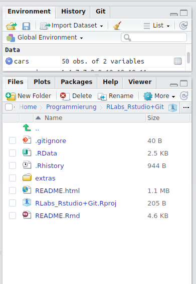
</div>


## Keyboard Shortcuts 1!
### Multicursor
Select multiple lines/positions for parallel editing  
- with Mouse: `CTRL+ALT+Click`  
- keyboard: `CTRL+ALT+UP/DOWN`  
- rename variable:  Select it and `CTRL+ALT+K`  

```{r, eval=FALSE, include=FALSE}
test2 <- 0
test2 <- function(test2) {
  test2
  test3
}
```

### Code snippets
Text macros that are used for quickly inserting common snippets of code ([see Blog](https://support.rstudio.com/hc/en-us/articles/204463668-Code-Snippets)). 
- Try `fun`, `lib`, `apply`, ...  
- Type `fun` and press `TAB` for shifting through arguments  

  <br>

### Test out
```{r}
# type `fun` and press TAB for shifting through arguments
ffun
ib
apply

# press CTRL+I for reintending code
test <- function() {
  hello <- "hello"
  if(is.character(hello)){
    print(hello)
    print("world")
    print("how are you?")
  }
  print(" - I feel obeserved")
}
test()
```


## Keyboard Shortcuts 2!
Press `SHIFT+ALT+K` for "all" shortcuts:  
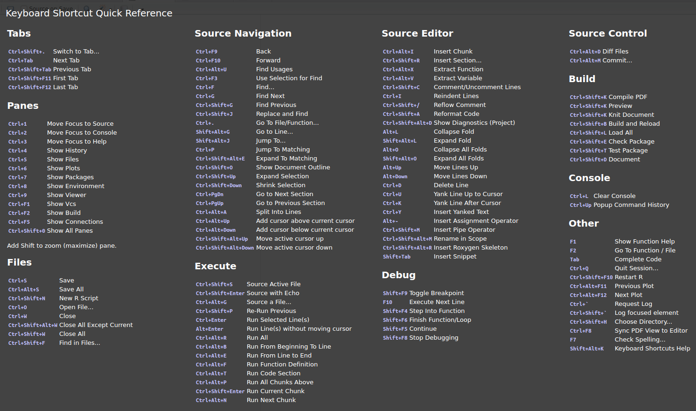


## Cheatsheets!
Open cheat sheets for `ggplot2`, `markdown`, and `more` directly from the menu bar.
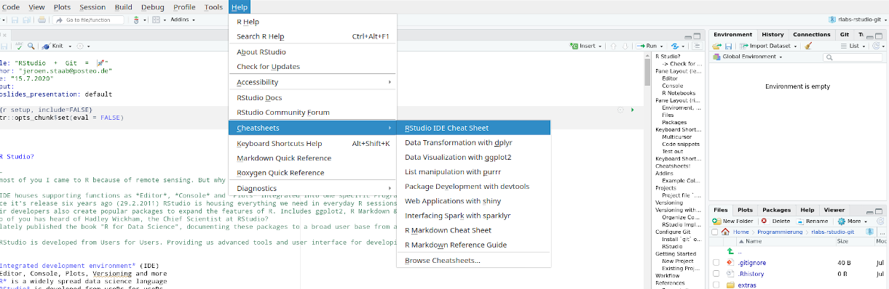


## Addins
<div class="columns-2">
How to install RStudio Addins?  
```{r}
# install.packages("addinslist")
addinslist:::addinslistAddin()
```

### Example Color Picker  
- Browse Addins  
- Install `colourpicker`  
- Click `Addins > Colour picker`  
- Returns a vector  
`c("red", "black", "green", "purple")`  
<br>
see also `colorHelper()`


</div>


## Projects

<div class="columns-2">
You already organize your files in folders.  
Why not add an extra file organizing your R sessions?  

### Project file `.Rproj`
- Automatically `setwd()`  
- Load `.Rdata` environment  
- Load `.Rhistory`
- Easily switch between projects
- Build packages
- Versioning with `git`  


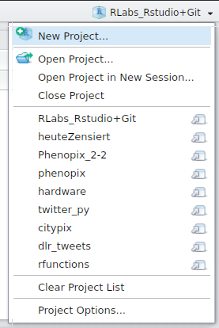
</div>


## Versioning
<!--
While developing code files are changed - that's a fact.  
On the other hand you might not want to touch a running system. 
How to keep track of changes?

Though this screen shot is a mockup, every file name includes date and a message
-->
`edit -> save as`  
File name includes date and message  

<br>

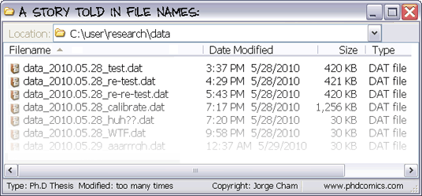  


## Versioning with Git
edit -> save `-> stage -> commit`  
Commit includes date and message  
Versioning tools like `git` keeps track of file changes  

<br>
<div class="columns-2">

### Organize Commits
  

### RStudio Implementation  
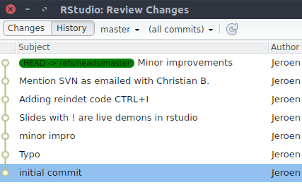  
</div>


## Configure Git
<div class="columns-2">
### Install `git` on your computer
- Visit [git-scm.com](https://git-scm.com/downloads)  
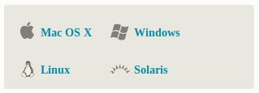  

### RStudio
- Global options  
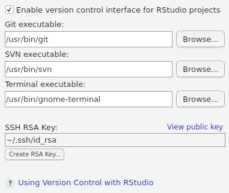  

<br>

- Project options  
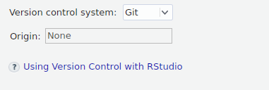  

- New pane (topright)  
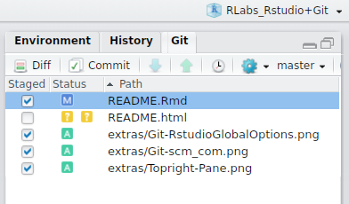  

- Interact w. cloud (opt-in)  
e.g. Github / Bitbucket
</div>

<!--
Interaction with cloud, push&pull is optional.
- bitbucket inlcudes privat repositories by default 
- github has biggest community. Privat repositories for free with uni-wuerzburg email adress. See:  https://education.github.com/pack/offers
-->

## Getting Started
<div class="columns-2">

### New Project
`Menu > File > New Project`  
  

<br>  

### Existing Directory
- Open directory in `terminal`. 
- Type `git init`
- `Restart` RStudio.  

<br>  

> Troubleshoot:  
Check project options.

</div>
## Workflow
- Stage:        Select file for next commit. Freezes state.
- Commit:       Create new node in time line. Add a message. 
- Push & pull:  Interact with remote repository.

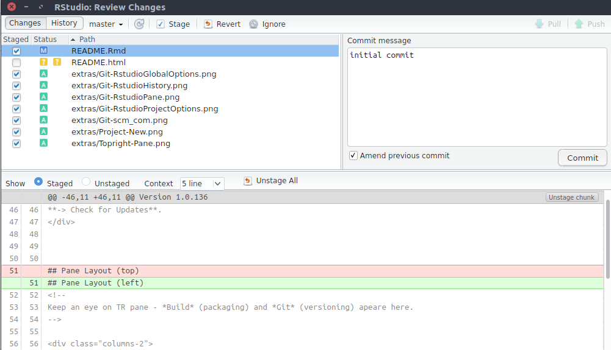  


  
## References
<div class="columns-2">
Rstudio  
- [Some RStudio Tipps](https://www.r-bloggers.com/rstudio-ide-easy-tricks-you-mightve-missed/)  
- [R Notebooks](http://rmarkdown.rstudio.com/r_notebooks.html)  
- [Code Snippets](https://support.rstudio.com/hc/en-us/articles/204463668-Code-Snippets?version=1.0.136&mode=desktop)  
- [Colour Picker Addin](https://www.r-bloggers.com/an-awesome-rstudio-addin-for-selecting-colours-and-another-for-adding-marginal-density-plots-to-ggplot2/)  

Git and SVN  
- [Version Control in RStudio](https://support.rstudio.com/hc/en-us/articles/200532077-Version-Control-with-Git-and-SVN)   
- [Git Documentation](https://git-scm.com/doc)

<br> 

### Presentation
- [Access on github](https://github.com/georoen/rlabs-rstudio-git/blob/master/rlabs.pdf)  
github.com/georoen

<br> 

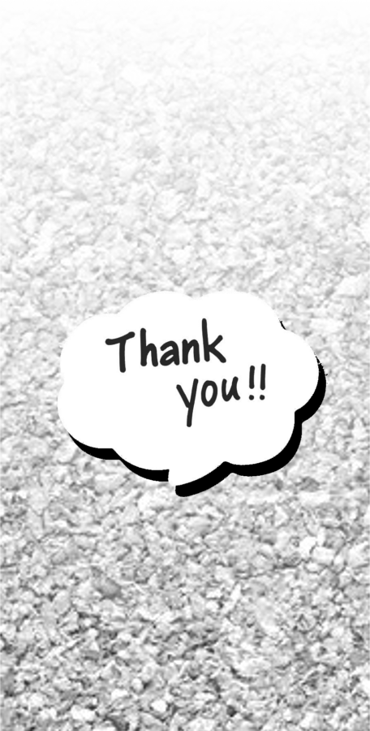  
</div>